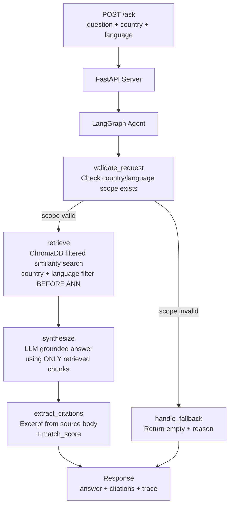

# Multi-Country Content Q&A with Citations

A RAG-based question-answering system for a multi-country B2B retail platform. Given a natural-language question, a country, and a language, it returns a grounded answer sourced exclusively from that country's official content — with verifiable citations pointing back to the exact source items.

---

## Architecture



```
┌─────────────────────────────────────────────────────────┐
│                    HTTP Layer (FastAPI)                   │
│  POST /ask  →  validates input  →  invokes agent         │
└──────────────────────┬──────────────────────────────────┘
                       │
┌──────────────────────▼──────────────────────────────────┐
│               LangGraph Agent (4 nodes)                  │
│                                                          │
│  validate_request ──► retrieve ──► synthesize            │
│       │                                ▼                 │
│       └──(fallback)──► handle_fallback extract_citations │
└──────────────────────────────────────────────────────────┘
                       │
┌──────────────────────▼──────────────────────────────────┐
│                  ChromaDB (local)                        │
│  Metadata per doc: content_id, country, language,        │
│  type, version, title                                    │
│  Filter applied AT query time (not post-retrieval)       │
└─────────────────────────────────────────────────────────┘
```

**Multi-tenant isolation guarantee**: The `retrieve` node passes a `where` filter `{country: X, language: Y}` directly to ChromaDB's ANN query. Content from other countries never enters the candidate set — it is excluded before similarity scoring, not after.

---

## Setup

### Prerequisites

- Python 3.10+
- Your own Anthropic or OpenAI API key (bring your own)
- No external services required — ChromaDB runs locally

### Install

```bash
git clone <your-repo>
cd tt-pepsi-ai-assignment
python -m venv .venv
source .venv/bin/activate  # Windows: .venv\Scripts\activate
pip install -r requirements.txt
```

### Configure

```bash
cp .env.example .env
# Edit .env and add your API key:
# ANTHROPIC_API_KEY=sk-ant-...  OR  OPENAI_API_KEY=sk-...
# Set LLM_MODEL accordingly (see .env.example)
```

### Run (single command)

```bash
bash start.sh
# Or with DB reset:
bash start.sh --reset
```

This will:
1. Start the FastAPI server on `http://localhost:8000`
2. POST `corpus.jsonl` to the `/ingest` endpoint to embed it into ChromaDB

### Ingest manually via the API

```bash
# Default corpus
curl -X POST http://localhost:8000/ingest \
  -F "file=@corpus.jsonl" \
  -F "reset=false"

# Re-ingest a different file and wipe existing data
curl -X POST http://localhost:8000/ingest \
  -F "file=@my_corpus.jsonl" \
  -F "reset=true"
```

Response:
```json
{ "status": "ok", "ingested": 44, "breakdown": { "A/en": 7, "A/hi": 5, ... } }
```

### Or ingest via CLI (no server needed)

```bash
python ingest.py --corpus corpus.jsonl --reset
```

---

## Example Requests

### Country B, Spanish — account closure

```bash
curl -X POST http://localhost:8000/ask \
  -H "Content-Type: application/json" \
  -d '{"question": "Can I cancel my account if I have pending orders?", "country": "B", "language": "es"}'
```

Expected response shape:
```json
{
  "answer": "Puede solicitar el cierre de cuenta en cualquier momento...",
  "language_used": "es",
  "citations": [
    {
      "content_id": "b_faq_account_es",
      "type": "FAQ",
      "excerpt": "Puede solicitar el cierre de cuenta en cualquier momento...",
      "match_score": 0.87
    }
  ],
  "trace": {
    "retrieval_count": 3,
    "latency_ms": 840,
    "model": "claude-haiku-4-5-20251001"
  }
}
```

### Multi-tenant isolation test — Country A asking in Spanish

```bash
curl -X POST http://localhost:8000/ask \
  -H "Content-Type: application/json" \
  -d '{"question": "¿Cuál es su política de devoluciones?", "country": "A", "language": "es"}'
```

Expected: empty citations, fallback message. Country B Spanish content must NOT appear.

### Health check

```bash
curl http://localhost:8000/health
```

---

## Run Evaluation Harness

```bash
python eval/run_eval.py
```

Runs 10 test questions (mix of languages, countries, isolation tests). Outputs pass/fail per case.

## Run Unit Tests

```bash
pytest tests/ -v
```

---

## Project Structure

```
tt-pepsi-ai-assignment/
├── corpus.jsonl              # 44-item sample corpus (JSONL)
├── ingest.py                 # Ingestion script: embed corpus → ChromaDB
├── start.sh                  # Single command: ingest + serve
├── requirements.txt
├── .env.example
├── src/
│   ├── agent/
│   │   ├── graph.py          # LangGraph graph definition + ask() entry point
│   │   ├── nodes.py          # Node implementations (validate, retrieve, synthesize, cite)
│   │   └── state.py          # AgentState TypedDict
│   ├── api/
│   │   └── server.py         # FastAPI app (POST /ask, GET /health)
│   └── db/
│       └── vector_store.py   # ChromaDB wrapper + retrieve_chunks()
├── eval/
│   └── run_eval.py           # Evaluation harness (10 test questions)
├── tests/
│   └── test_core.py          # Unit tests (filtering, citations, ranking)
└── screenshots/              # Visual evidence of working system
```

---

## Known Limitations

- **No sub-chunking**: Each corpus item is stored as a single document. For longer documents this reduces precision; a sliding-window chunker would improve citation granularity. The corpus items are short enough that this is acceptable for the prototype.
- **Excerpt length**: Citations show the first ~200 characters of the source body. The full body is used for retrieval and synthesis; only the excerpt display is truncated.
- **Fallback is "return empty"**: When a caller requests a language not available in their country, the system returns an empty citations list with an explanation rather than falling back to another language. This avoids silently answering in a different language than requested.
- **No caching**: Every request hits the LLM. A simple TTL cache on (question, country, language) would reduce cost and latency in practice.
- **Single-node ChromaDB**: Production would need a persistent, replicated vector store (pgvector or managed Qdrant).

## What I Would Do Next With More Time

1. **Sub-document chunking**: Split long T&C bodies into paragraphs with overlap for finer-grained citations.
2. **Reranker**: Add a cross-encoder reranker between retrieval and synthesis to improve citation precision.
3. **Query translation**: If a user asks in a language that exists in their country but is not their question language, translate the query before embedding to improve recall.
4. **Streaming**: Return the answer as a stream to reduce perceived latency.
5. **Observability**: Structured logs per request with country, language, latency, token cost.
