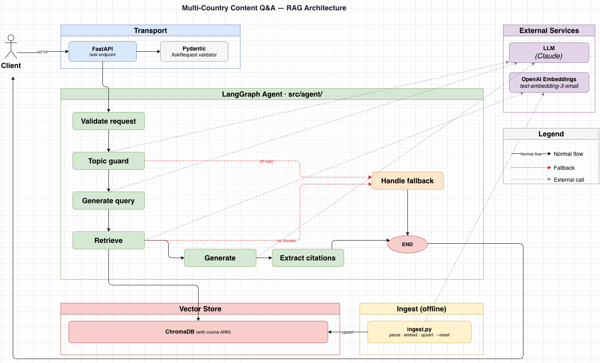
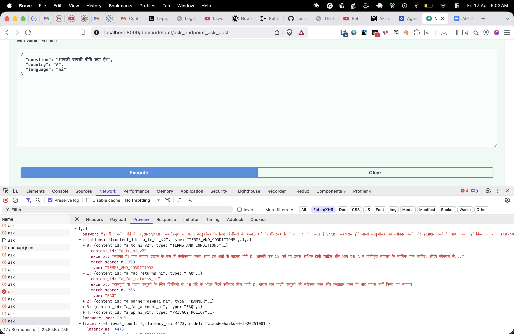
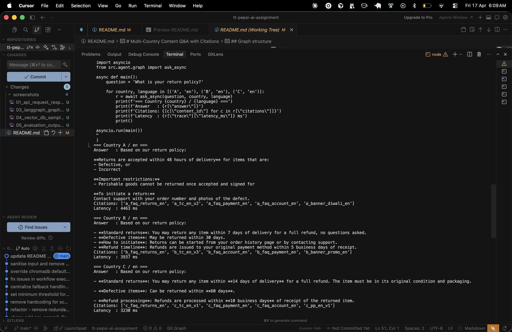
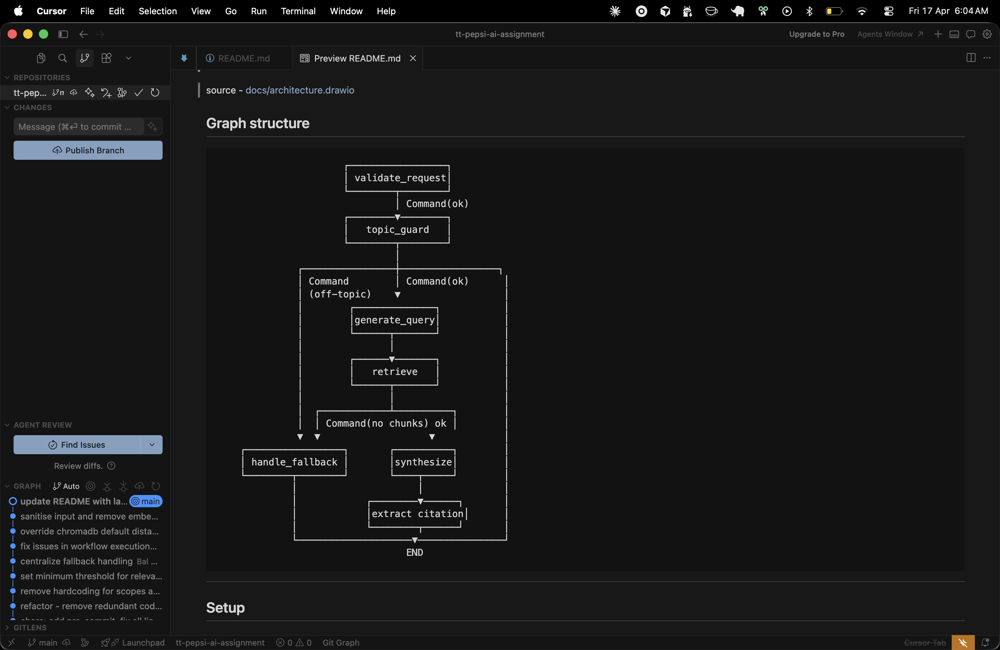
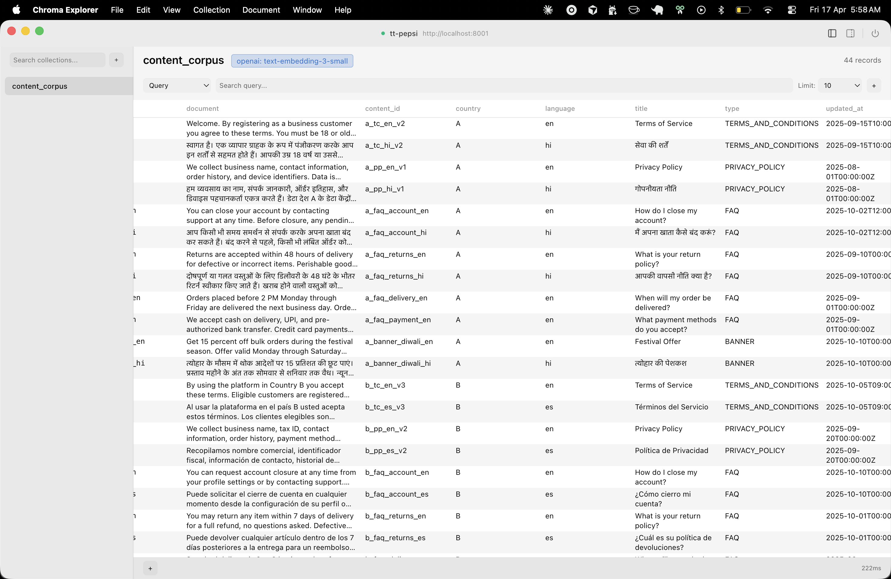
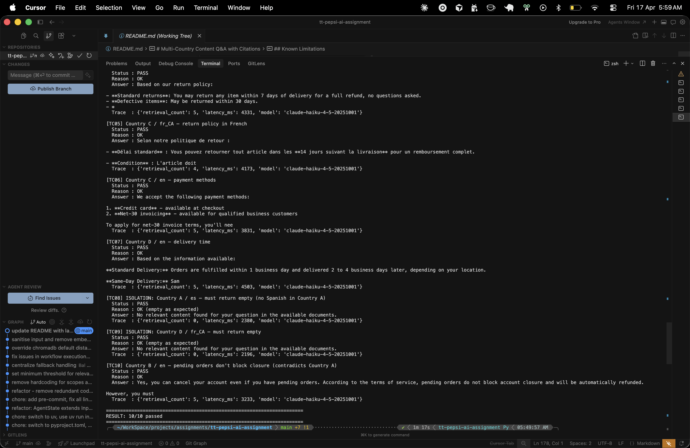

# Multi-Country Content Q&A with Citations

No one has the patience to through long articles these days. Either users directly try to reach customer support or they end up being frustated.
With the advent of LLM we can solve this problem. Users can ask their query in natural language and we'll respond to them in natural language with the response that's grounded in the official content.

This is a small working POC for customer-domain platform for that'll be used by multi-country B2B retail business to help end users get support resolved quickly. We've corpus of official content provided. We're using Claude models for LLM calls, OpenAI for emmbedding, Chroma for vector storage, FastAPI for api layer.

## Table of Contents

- [Overall Architecture](#overall-architecture)
- [Graph Structure](#graph-structure)
- [Screenshots](#screenshots)
- [Setup](#setup)
  - [Prerequisites](#prerequisites)
  - [Install](#install)
  - [Ingest corpus + start server](#ingest-corpus--start-server)
  - [Start server only](#start-server-only-corpus-already-ingested)
- [Example Requests](#example-requests)
- [Country Isolation Proof](#country-isolation-proof)
- [Run Evaluation Harness](#run-evaluation-harness)
- [Run Unit Tests](#run-unit-tests)
- [What I Would Do Next With More Time](#what-i-would-do-next-with-more-time)
- [Known Limitations](#known-limitations)

---

## Overall Architecture



source - [docs/architecture.drawio](docs/architecture.drawio)

## Graph structure

```
                      ┌─────────────────┐
                      │ validate_request│
                      └────────┬────────┘
                               │ Command(ok)
                      ┌────────▼────────┐
                      │   topic_guard   │
                      └────────┬────────┘
                               │
              ┌────────────────┼─────────────────┐
              │ Command        │ Command(ok)      │
              │ (off-topic)    ▼                  │
              │        ┌──────────────┐           │
              │        │generate_query│           │
              │        └──────┬───────┘           │
              │               │                   │
              │        ┌──────▼───────┐           │
              │        │   retrieve   │           │
              │        └──────┬───────┘           │
              │               │                   │
              │  ┌────────────┴──────────┐        │
              │  │ Command(no chunks) ok │        │
              ▼  ▼                   ▼            │
    ┌─────────────────┐       ┌──────────┐        │
    │ handle_fallback │       │synthesize│        │
    └────────┬────────┘       └────┬─────┘        │
             │                     │              │
             │            ┌────────▼──────┐       │
             │            │extract citation│      │
             │            └────────┬──────┘       │
             └────────────────────▼───────────────┘
                                 END
```

---

## Setup

### Prerequisites

- [uv](https://docs.astral.sh/uv/) (`brew install uv` or `pip install uv`)

### Install

```bash
git clone <your-repo>
cd tt-ai-assignment
cp .env.example .env
# update keys in .env:
uv sync
```

### Ingest corpus + start server

```bash
# Ingest the sample corpus and start the API server
bash start.sh

# Re-ingest with a clean slate
bash start.sh --reset
```

`start.sh` runs `ingest.py` first (embeds `corpus.jsonl` into ChromaDB), then starts uvicorn on `http://localhost:8000`.

### Start server only (corpus already ingested)

```bash
uv run uvicorn src.api.server:app --host 0.0.0.0 --port 8000 --reload
```

---

## Example Requests

### Ask a question — Country B, Spanish corpus

```bash
curl -X POST http://localhost:8000/ask \
  -H "Content-Type: application/json" \
  -d '{
    "question": "Can I cancel my account if I have pending orders?",
    "country": "B",
    "language": "es"
  }'
```

### Ask in Hindi — Country A

```bash
curl -X POST http://localhost:8000/ask \
  -H "Content-Type: application/json" \
  -d '{
    "question": "आपकी वापसी नीति क्या है?",
    "country": "A",
    "language": "hi"
  }'
```

### Isolation test — Country A asking in Spanish (no Spanish content exists for A)

```bash
curl -X POST http://localhost:8000/ask \
  -H "Content-Type: application/json" \
  -d '{
    "question": "¿Cuál es su política de devoluciones?",
    "country": "A",
    "language": "es"
  }'
```

### Health check

```bash
curl http://localhost:8000/health
# {"status": "ok", "collection_size": 44}
```

---

## Run Evaluation Harness

```bash
uv run python eval/run_eval.py           # 10 test cases, pass/fail summary
uv run python eval/run_eval.py --verbose # includes answer text + trace per case
```

Covers: 4 countries × multiple languages, cross-language isolation tests, pending-order edge cases.

## Run Unit Tests

```bash
uv run pytest tests/ -v
```


---


## What I Would Do Next With More Time

- Streaming response.

- Multi-turn conversation.

- LangGraph persistence(to allow users to resume the session from where they left off)

- Retrieval grading (CRAG).

- Sub-document chunking.

- Improve latency, right now it takes 3-4+ seconds.

## Known Limitations

- Right now excerpt is always the first 200 chars of the body but it is not necessarily the most semantically relevant sentence.

- Single-node ChromaDB. The vector store runs in-process on local disk. Production would need a replicated persistent store (pgvector, Qdrant Cloud, etc.).

- No request caching. Every `/ask` call hits the embedding model and LLM. A TTL cache keyed on `(question, country, language)` would cut cost and latency significantly for repeated queries.

- Nodes are sync at the DB layer. `retrieve_chunks()` calls ChromaDB synchronously inside an async node. ChromaDB has no async client; a thread-pool executor would prevent event-loop blocking under load.

---

## Screenshots

**API request / response**


**Multi-tenant isolation**


**LangGraph state graph**


**Vector DB sample**


**Evaluation harness output**

